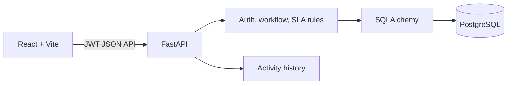

# EduSupport

EduSupport is a focused student support and ticket management MVP for colleges. It gives students a clear way to raise and track requests while giving support staff and managers operational visibility into ownership, status, SLA risk, and audit history.

## Run locally

### Docker Compose

```bash
docker compose up --build
```

- Frontend: http://localhost:5173
- API docs: http://localhost:8000/docs
- Health check: http://localhost:8000/api/health

Demo accounts all use password `demo123`:

| Role | Email |
| --- | --- |
| Student | student@edusupport.demo |
| Staff | staff@edusupport.demo |
| Manager | manager@edusupport.demo |

### Run without Docker

```bash
cd backend
pip install -r requirements.txt
python seed.py
uvicorn app.main:app --reload

cd ../frontend
npm install
npm run dev
```

Set `DATABASE_URL` to a PostgreSQL connection string when running outside Compose. Without it, the backend uses SQLite for a quick local smoke test.

## Product scope

- JWT authentication with Student, Staff, and Manager roles
- Backend-enforced ownership and role authorization
- Ticket creation, assignment, priority, controlled status transitions, reopening, and comments
- SLA due dates based on priority: Low 72h, Medium 48h, High 24h, Urgent 8h
- Activity/audit history for creation, assignment, status changes, and comments
- Search and status filtering
- Role-aware dashboard metrics and SLA breach visibility
- Seeded demo data and API tests

## Architecture

The MVP is a small modular monolith: FastAPI owns the business rules and API contract, SQLAlchemy owns persistence, PostgreSQL is the production local-service database, and Vite/React provides the browser workflow. This keeps deployment and review simple while leaving clear boundaries for later extraction.



## Data model

| Table | Purpose |
| --- | --- |
| `users` | Identity, role, availability, password hash |
| `tickets` | Student request, classification, SLA, ownership, lifecycle |
| `ticket_comments` | Conversation attached to a ticket |
| `ticket_activity` | Append-only operational history |

The ticket keeps current state for fast queue queries, while activity preserves why that state changed. Assignment history is represented in activity for the MVP and can become a dedicated table if reassignment reporting requires richer metadata.

## API surface

- `POST /api/auth/register`
- `POST /api/auth/login`
- `GET /api/auth/me`
- `GET /api/tickets?search=&status=&priority=`
- `POST /api/tickets`
- `GET /api/tickets/{ticket_id}`
- `PATCH /api/tickets/{ticket_id}`
- `POST /api/tickets/{ticket_id}/comments`
- `GET /api/dashboard`

FastAPI publishes the interactive OpenAPI contract at `/docs`.

## Validation and edge cases

The backend is the source of truth for security and workflow rules. Students only query their own tickets, cannot create staff actions, and receive a not-found response for another student's ticket. Staff and managers can operate queues, but assignments must target a Staff user. Invalid lifecycle transitions return `422`; resolved tickets can be reopened, while closed tickets cannot move again.

The test suite covers health, authenticated login, ticket creation, and student ticket isolation at the API boundary. Additional production hardening would add PostgreSQL integration tests for concurrent claims, migrations, rate limiting, attachments, email notifications, and duplicate similarity detection. Assignment should use a conditional update or row lock when concurrent claiming is introduced.

## Assumptions and trade-offs

- Managers are trusted to assign and change operational fields; registration defaults to Student but is intentionally open for demo convenience.
- SLA due time is resolution SLA, not first-response SLA; both values are centralized in `SLA_HOURS` for the next iteration.
- The MVP uses `create_all` plus seed data to minimize setup. A deployed version should use Alembic migrations.
- Attachments, notifications, and AI classification are intentionally left out of the critical path. A human confirms any future AI suggestion before it changes a ticket.

## Tests

```bash
cd backend
python -m pytest -q
```

```bash
cd frontend
npm run build
```

## Submission documents

- [Architecture and decisions](docs/architecture.md)
- [Assumptions and trade-offs](docs/assumptions.md)
- [AI Usage Report](docs/ai-usage-report.md)